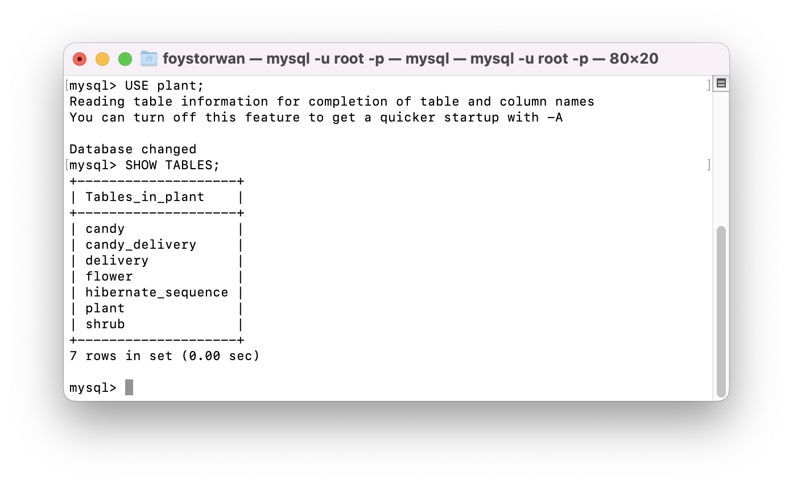

# Plant-Delivery Service

A **practice project** from the **Data Stores & Persistence** course in [Java Web Developer Nanodegree](https://www.udacity.com/course/java-developer-nanodegree--nd035) at Udacity.

[_See the final project of this course._](https://github.com/Foystor/CritterChronologer)

This is a plant-delivery service that supports delivering bushes in addition to flowers, and acquired a candy business because customers want to be able to add candy to their plant deliveries.

## Technologies

### Data in Multitier Architecture

- Create `Entities` for `Delivery` and `Plant`, including its subclasses for `Flower` and `Shrub`.
- Use `JOINED` inheritance strategy for plants.
- Establish a bidirectional `OneToMany` and `ManyToOne` relationship between `Delivery` and `Plant`.
- Use `DTO` and `@JSONView` annotation to convert plant data into the format used by recipients.

### Java Persistence API (JPA)

- Create `Repository` for `Delivery` using `Hibernate` and `EntityManager`.
- Create `Repository` for `Plant` using `Spring Data JPA`.
- Use `Lazy Loading` and `Cascading` to manage their persistence operations.
- Query with `@NamedQuery` and `CriteriaBuilder/Projection` in `DeliveryRepository`.
- Query with specific `JPQL` queries and method names in `PlantRepository`.

### Connecting To Data Sources

- Configure `DataSource` with `application.properties` file and programmatic configuration.
- Configure initialization and sql commands printing with `application.properties` file.
- Use `@DataJpaTest` and `TestEntityManager` to create unit tests.

### Persistence Without JPA

- Use `schema.sql` and `data.sql` to create and populate the `candy` table.
- Create the mapping table called `candy_delivery` with `schema.sql` to add candy to the deliveries.
- Create a `CandyData` class to map to the `candy` table.
- Define an interface called `CandyDAO` and create a class called `CandyDAOImpl` to implement it with `NamedParameterJdbcTemplate`, `@Repository` and `@Transactional`.

## License

[MIT License](LICENSE)